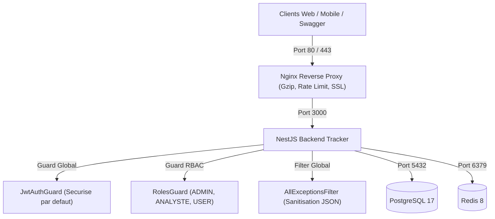

# Stars Investment Group - API Tracker

API REST financiere de suivi d'investissements multi-actifs, de gestion de portefeuilles, d'analyse macroeconomique UEMOA et de correlation d'actualites de marche.

---

## Sommaire

1. [Presentation du Projet](#presentation-du-projet)
2. [Fonctionnalites Principales](#fonctionnalites-principales)
3. [Stack Technologique](#stack-technologique)
4. [Architecture et Securite](#architecture-et-securite)
5. [Structure du Projet](#structure-du-projet)
6. [Pre-requis et Installation Locale](#pre-requis-et-installation-locale)
7. [Execution avec Docker](#execution-avec-docker)
8. [Tests et Qualite de Code](#tests-et-qualite-de-code)
9. [Documentation des Endpoints (Swagger)](#documentation-des-endpoints-swagger)
10. [Deploiement en Production](#deploiement-en-production)

---

## Presentation du Projet

Le backend `backend_tracker` de Stars Investment Group fournit une infrastructure centralisee et performante pour la gestion et le suivi des actifs financiers (Actions, Obligations, Cryptomonnaies, Forex, Matieres Premieres), ainsi que l'integration des donnees macroeconomiques de la zone UEMOA (BCEAO via DBnomics).

L'API permet aux utilisateurs de piloter leurs investissements, de calculer leurs positions et cours moyens ponderes en temps reel, de recevoir des alertes de marche et d'evaluer l'impact direct des actualites financieres sur leurs portefeuilles detenu.

---

## Fonctionnalites Principales

### 1. Authentification et Securite des Acces
* Inscription et connexion securisee avec hachage bcrypt (10 tours de salage).
* Authentification basee sur des Tokens JWT (Access Token a duree courte + Refresh Token a rotation).
* Stockage securise du hash des Refresh Tokens en base pour prevenir toute tentative de rejeu ou de vol de session.
* Controle d'acces base sur les roles (RBAC) : `USER`, `ANALYSTE`, `ADMIN`.
* Isolation stricte des donnees par utilisateur (verification d'appartenance sur chaque ressource).

### 2. Gestion de Portefeuilles Multi-Devises
* Creation et gestion de multiples portefeuilles par utilisateur avec devises configurables (USD, XOF, EUR, etc.).
* Calcul automatique des positions nettes et des prix moyens d'achat (PMP) via des requetes SQL parametrees et performantes.

### 3. Transactions et Regles Metier
* Enregistrement des operations d'achat, de vente et de perception de dividendes.
* Verification de solde avant execution d'une vente pour empecher toute vente a decouvert non autorisee.
* Historisation complete avec horodatage, frais de courtage et notes.

### 4. Referentiel des Instruments Financiers
* Catalogue multi-classes d'actifs (equity, bond, crypto, fx, commodity).
* Support des identifiants normalises internationaux : ISIN, CUSIP, SEDOL, Tickers.
* Protection d'integrite referentielle interdisant la suppression d'un instrument associe a des transactions existantes.

### 5. Cotations et Historique des Cours (OHLCV)
* Stockage des donnees de marche Open, High, Low, Close, Volume.
* Ingestion unitaire et par lot (bulk ingestion) optimisee par upsert composite.
* Recherche par identifiant d'instrument ou par symbole boursier (ticker) avec filtres de dates.

### 6. Module Macroeconomique UEMOA / BCEAO
* Pipeline ETL (Extract, Transform, Load) automatique connecte a l'API DBnomics.
* Extraction des series economiques (taux directeurs, PIB, agregats monetaires).
* Tache planifiee automatique executee quotidiennement (Cron 6h00).

### 7. Actualites Financieres et Impact sur Portefeuille
* Flux d'actualites categorise par classe d'actifs et analyse de sentiment (positif, neutre, negatif).
* Filtrage des alertes urgentes (breaking news) et articles les plus lus.
* Algorithme d'analyse d'impact : correlation directe entre un article de presse et les positions reelles detenues par l'utilisateur connecte.

### 8. Listes de Surveillance (Watchlists) et Alertes
* Creation de watchlists personnalisees multi-instruments.
* Configuration d'alertes personnalisees (cours, actualites, indicateurs macroeconomiques).

### 9. Audit et Tracabilite
* Journalisation automatique de toutes les actions sensibles (inscriptions, connexions, modifications de profil, changements de roles, suppressions).
* Enregistrement des valeurs avant/apres modification, adresses IP et User-Agent.

### 10. Sonde de Sante (Healthcheck)
* Endpoint `/health` verifiant l'etat du serveur et la connectivite effective avec PostgreSQL.

---

## Stack Technologique

* **Framework Backend** : NestJS 11 (TypeScript, architecture modulaire et injection de dependances)
* **ORM & Base de Donnees** : Prisma ORM 5.4 avec PostgreSQL 17
* **Cache & Sessions** : Redis 8
* **Securite HTTP** : Helmet, NestJS Throttler (Rate Limiting), Passport JWT
* **Validation & Transformation** : `class-validator`, `class-transformer`
* **Documentation API** : Swagger / OpenAPI 3.0
* **Conteneurisation** : Docker Multi-Stage, Docker Compose
* **Reverse Proxy** : Nginx avec compression Gzip et limitation de requetes
* **Tests** : Jest, Supertest
* **Gestionnaire de Paquets** : pnpm

---

## Architecture et Securite



### Principes de Securite Appliques
1. **Securite par Defaut** : Toutes les routes sont protegees par JWT a l'exception de celles annotees explicitement avec `@Public()`.
2. **Sanitisation des Erreurs** : Aucune trace d'erreur SQL ou interne n'est transmise aux clients en cas d'incident serveur.
3. **Protection des En-tetes** : Integration de Helmet pour bloquer le clickjacking, le cross-site scripting et le MIME-sniffing.
4. **Tracabilite des Requetes** : Attribution d'un `X-Request-ID` unique pour chaque requete entrante.

---

## Structure du Projet

```text
backend_tracker/
├── .github/
│   └── workflows/
│       └── ci-cd.yml             # Pipeline d'integration et deploiement continu
├── deploy/
│   ├── nginx/
│   │   ├── nginx.conf            # Configuration principale Nginx
│   │   └── conf.d/default.conf   # VirtualHost, proxy pass et SSL
│   ├── scripts/
│   │   ├── setup-vps.sh          # Script d'initialisation du serveur VPS
│   │   └── deploy.sh             # Script de deploiement en 1 commande
│   ├── docker-compose.prod.yml   # Stack Docker de production
│   ├── docker-entrypoint.sh      # Script d'entree et migrations Prisma
│   └── .env.production.example   # Modele de configuration de production
├── prisma/
│   ├── schema.prisma             # Modeles de donnees et relations PostgreSQL
│   └── migrations/               # Historique des migrations de base de donnees
├── src/
│   ├── alerts/                   # Module d'alertes personnalisees
│   ├── audit/                    # Module de journalisation et audit trail
│   ├── auth/                     # Module d'authentification et strategies JWT
│   ├── database/                 # Module de connexion Prisma DatabaseService
│   ├── health/                   # Sonde de sante /health
│   ├── instrument/               # Referentiel des actifs financiers
│   ├── news/                     # Actualites, calendrier economique et impact
│   ├── portfolio/                # Gestion des portefeuilles utilisateurs
│   ├── portfolio_positions/      # Calculs des positions nettes
│   ├── price_history/            # Cotations historiques OHLCV
│   ├── sig/                      # Composants transversaux (Guards, Decorators, Filters, Middlewares)
│   ├── transaction/              # Operations d'achat/vente/dividendes
│   ├── uemoa/                    # Pipeline ETL macroeconomique DBnomics
│   ├── users/                    # Gestion des utilisateurs et profils
│   ├── watchlists/               # Listes de suivi multi-instruments
│   ├── app.module.ts             # Module racine de l'application
│   └── main.ts                   # Point d'entree et bootstrap NestJS
├── Dockerfile                    # Dockerfile Multi-Stage (Dev, Build, Prod)
├── docker-compose.yml            # Stack Docker de developpement local
├── DEPLOYMENT.md                 # Guide complet de deploiement sur VPS
├── package.json
└── tsconfig.json
```

---

## Pre-requis et Installation Locale

### Pre-requis
* **Node.js** : version 22 LTS ou superieure
* **pnpm** : version 11 ou superieure (`corepack enable` ou `npm install -g pnpm`)
* **PostgreSQL** : version 16 ou 17
* **Redis** : version 7 ou 8

### 1. Cloner le projet et installer les dependances
```bash
git clone https://github.com/Stars-Investment-Group/backend_tracker.git
cd backend_tracker
pnpm install
```

### 2. Configurer les variables d'environnement
Copiez le fichier d'exemple `.env.example` vers `.env` :
```bash
cp .env.example .env
```

Ajustez les valeurs si necessaire :
```env
NODE_ENV=development
PORT=3000
CORS_ORIGIN=*

JWT_SECRET=dev-jwt-secret-key-change-in-production-min-32-chars
JWT_REFRESH_SECRET=dev-jwt-refresh-secret-key-change-in-production

DB_HOST=localhost
DB_PORT=5432
DB_USER=postgres
DB_PASSWORD=postgres
DB_NAME=sig_db
DATABASE_URL="postgresql://${DB_USER}:${DB_PASSWORD}@${DB_HOST}:${DB_PORT}/${DB_NAME}?schema=public"

REDIS_HOST=localhost
REDIS_PORT=6379
```

### 3. Generer le client Prisma et initialiser la base de donnees
```bash
pnpm prisma generate
pnpm prisma db push
```

### 4. Lancer l'application en mode developpement
```bash
pnpm run start:dev
```
L'API est accessible sur `http://localhost:3000`.
Le Swagger est disponible sur `http://localhost:3000/api`.

---

## Execution avec Docker

### Mode Developpement Local (Backend + PostgreSQL + Redis)
```bash
docker compose up -d
```
Le backend recharge automatiquement le code a chaque modification grace aux volumes montes.

### Arreter les conteneurs de developpement
```bash
docker compose down
```

---

## Tests et Qualite de Code

Le projet comprend une suite complete de tests unitaires et d'integration couvrant l'ensemble des modules metier et des controleurs.

### Executer tous les tests unitaires
```bash
pnpm run test
```

### Executer les tests avec calcul de couverture
```bash
pnpm run test:cov
```

### Executer les tests en mode watch
```bash
pnpm run test:watch
```

### Executer la verification TypeScript et le Linter
```bash
pnpm run build
pnpm run lint
```

---

## Documentation des Endpoints (Swagger)

Une fois l'application demarree, la documentation interactive Swagger OpenAPI 3.0 est disponible sur :
```
http://localhost:3000/api
```

### Principaux Groupes d'Endpoints

| Module | Route Principale | Description |
| :--- | :--- | :--- |
| **Auth** | `/auth/register`, `/auth/login`, `/auth/refresh`, `/auth/logout` | Authentification, renouvellement de tokens, deconnexion. |
| **Users** | `/users`, `/users/:id`, `/users/:id/role` | Administration et consultation des comptes utilisateurs. |
| **Portfolio** | `/portfolio`, `/portfolio/:id` | Creation, consultation et gestion des portefeuilles. |
| **Positions** | `/portfolio-positions`, `/portfolio-positions/portfolio/:id` | Calcul des positions detenues et prix moyens d'achat. |
| **Transactions**| `/transaction`, `/transaction/:id` | Enregistrement des achats, ventes et dividendes. |
| **Instruments**| `/instrument`, `/instrument/:id` | Consultation et administration du catalogue d'actifs. |
| **Price History**| `/price-history`, `/price-history/bulk`, `/price-history/ticker/:ticker` | Ingestion et consultation des cotations OHLCV. |
| **UEMOA** | `/uemoa/indicators`, `/uemoa/series`, `/uemoa/sync` | Donnees economiques BCEAO/DBnomics et synchronisation manuelle. |
| **News** | `/news`, `/news/breaking`, `/news/most-read`, `/news/:id/impact` | Actualites financieres, calendrier economique et impact portefeuille. |
| **Alerts** | `/alerts`, `/alerts/:id` | Alertes de marche et notifications de seuils. |
| **Watchlists** | `/watchlists`, `/watchlists/:id/instruments` | Listes de suivi personnalisees. |
| **Audit** | `/audit` | Consultation de l'historique des actions d'audit. |
| **Health** | `/health` | Sonde de disponibilite de l'API et de PostgreSQL. |

---

## Deploiement en Production

Consultez le guide dedie : **[DEPLOYMENT.md](DEPLOYMENT.md)**

### Resume du deploiement en 3 commandes sur le VPS :
```bash
# 1. Initialisation du VPS (Docker, UFW, paquets)
./deploy/scripts/setup-vps.sh

# 2. Configuration de l'environnement de production
cp deploy/.env.production.example .env.production && nano .env.production

# 3. Lancement de la stack complete de production
./deploy/scripts/deploy.sh
```

---

## Licence

Projet sous licence privee proprietaire - Stars Investment Group. Tous droits reserves.
